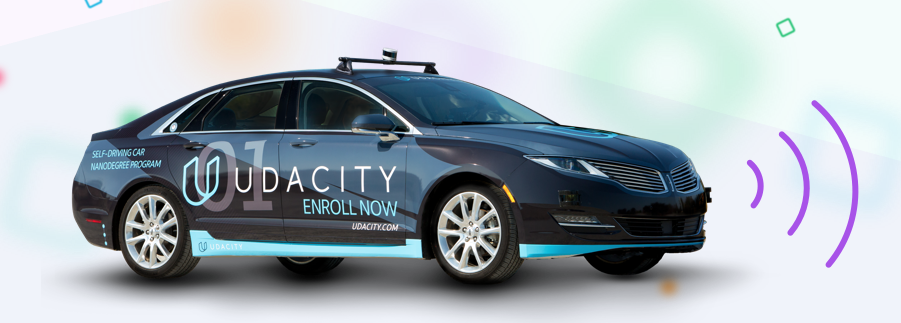
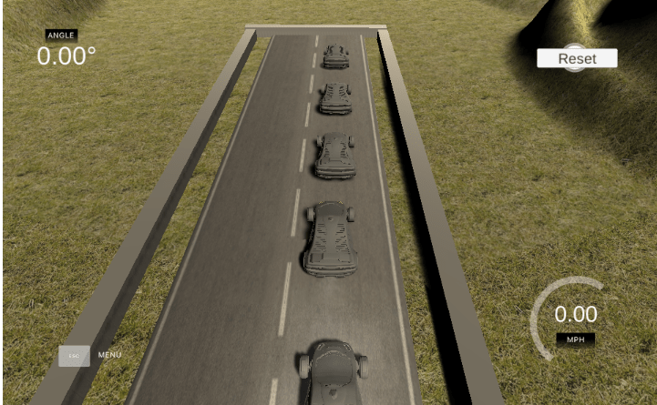
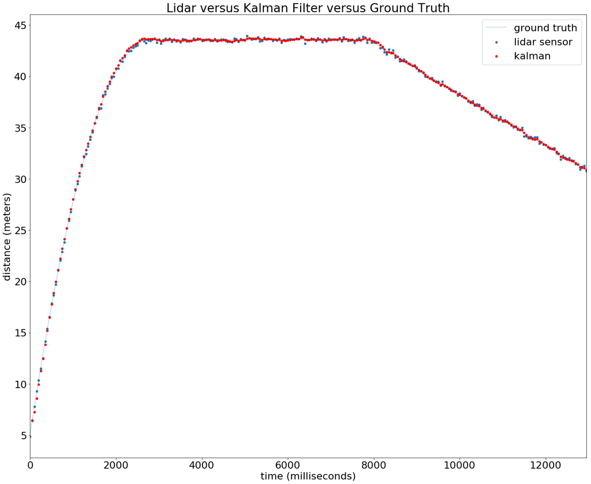
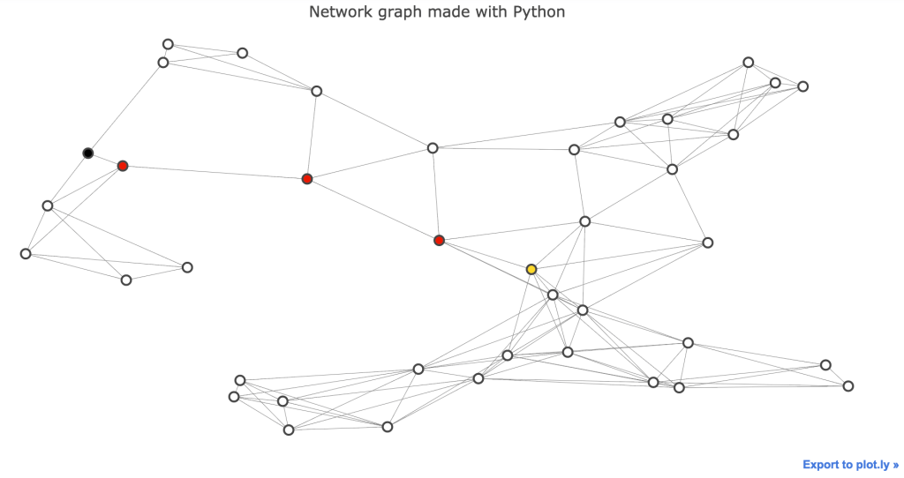

# intro-self-driving-cars
In this repository you can find my results of all projects and relevant exercises of the [Udacity Intro to Self-Driving Cars Nanodegree](https://www.udacity.com/course/intro-to-self-driving-cars--nd113).

## Chapters

The nanodegree was subdivided into the following chapters:

1. Orientation
2. Bayesian Thinking
3. Working with Matrices
4. C++ Basics
5. Performance Programming in C++
6. Navigating Data Structures
7. Vehicle Motion and Control
8. Computer Vision and Machine Learning

## Projects

1. **JoyRide - Reverse parking of a self-driving car**
    
2. **Implementation of a Matrix Class in Python**
    
    - [Source](3_5_Project_2_Implement_Matrix_Class/kalman_filter_demo.ipynb)
3. **Translation of a Python Histogram Filter to C++**
4. **A Star routing algorithm in Python**
    

    ​
5. **Computer Vision based Traffic Light Classifier**
    ​

